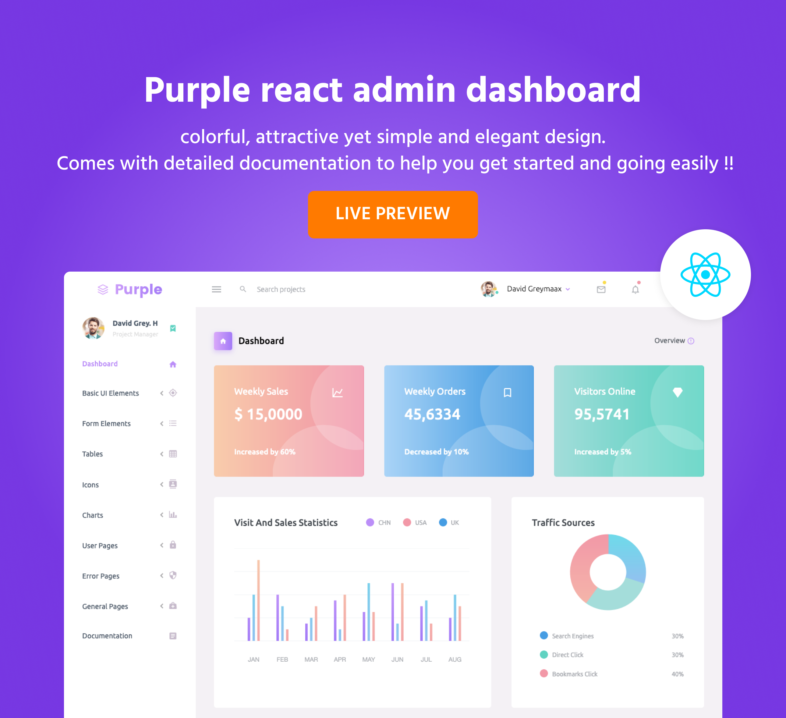

# Purple React Free Admin Template

Purple Admin React Free comes packed with a essential components, UI elements, and built-in sample pages to kick-start your project.

We are excited to share this dashboard with you and look forward to hearing your feedback!

## Demo

Visit: https://www.bootstrapdash.com/demo/purple-react-free/template/demo_1/preview/dashboard

[](https://www.bootstrapdash.com/demo/purple-react-free/template/demo_1/preview/dashboard)


## Credits:

.React-bootstrap 

.Material Design Icons

.React

.Chart.js


## Browser Support: 

Chrome (latest)

FireFox (latest)

Safari (latest)

Opera (latest)

IE10+

## License Information:

Purple Admin React free is released under MIT license. Feel free to download it, use it, share it, and get creative with it.


## Installation

### What's included

Within the download you'll find the following directories and files, logically grouping common assets and providing both compiled and minified variations. You'll see something like this:

```
purple-react-free/
  ├── template
    ├── demo_1
        ├── src/
            ├── app/
            ├── assets/
                ├── images/
                ├── styles/
            ├── index.js
        ├── public/
        ├── .gitignore
        ├── CHANGELOG.md
        ├── package.json
  ├── CHANGELOG.md
  ├── documentation
  ├── LICENSE
  ├── README.md


```

### How to use Purple Admin React?

``` bash
# Click the Clone or Download button in GitHub and download as a ZIP file or you can enter the command
$ git clone https://github.com/BootstrapDash/purple-react-free.git in your terminal to get a copy of this template.

# After the files have been downloaded you will get a folder with all the required files

# You can install all the dependencies in the template by running the command 'npm install'. All the required files are in the node modules.

# You can serve the template with the command 'npm start'.

# Now that your project has now kick-started, all you need to do now is to code, code, and code to your heart's content.
```


### How to Contribute?:

``` bash
# We love your contributions and we welcome them wholeheartedly. We believe the more the merrier. To contribute make sure you have a Node.js and npm installed.
```
## Next
After node and npm have been installed, follow the steps below to contribute.

``` bash
1 - Fork and clone the repo of Purple React Admin.
2 - Run the command 'npm install' to install all the dependencies.
3 - Enter the command 'npm start'. This will open Purple React Admin in your default browser.
4 - Make your valuable contribution
5 - Submit a pull request.
...
Do you need a template with more features and functionalities? Get more with our collection of the premium template with more plugins, eye catching animations, UI components, and sample pages all fitting together with a high-quality design. Visit https://www.bootstrapdash.com for more admin templates.
